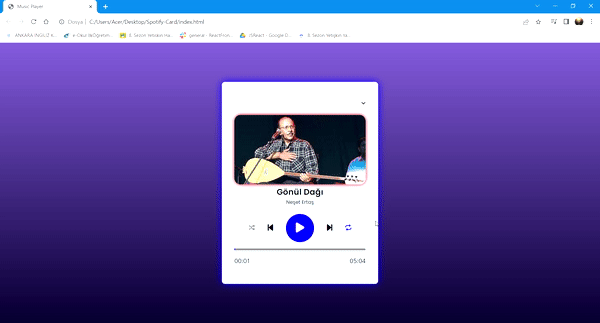

<h1> Music Player </h1>

I designed an mp3 player with JS, HTML5 and CSS3. I created the link, name and artist information of the music I listed in the project using the JSON method. When the music ended, I met the "Return to start" or "Shuffle" conditions.

<h1> Used Technologies </h1>
HTML5, CSS3, JS

<h2> SCREENSHOT </h2>

